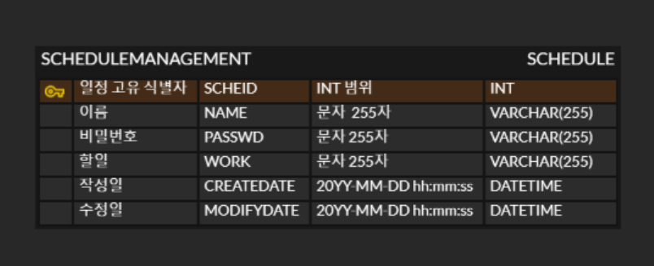

# LEVEL0. 일정 관리 RESTful API 명세서

| 기능         | HTTP Method | URL                      | Request Body                                                                   | Response Body                                                                                                                           | 상태 코드                                                                    |
|--------------|-------------|---------------------------|--------------------------------------------------------------------------------|-----------------------------------------------------------------------------------------------------------------------------------------|--------------------------------------------------------------------------|
| 일정 생성    | POST        | /api/schedules            | { "name": "wonjun", "passwd": "qwer1234, "work": "assignment"}                 | { "scheId": 1, "name": "wonjun", "work": "assignment", "createDate": "2025-05-22T00:01:23", "modifyDate": "2025-05-22T00:01:23" }       | 201 Created                                                              |
| 일정 목록 조회 | GET         | /api/schedules            | - (Query Params: name=wonjun, modifyDate=2025-05-22)                           | [ { "scheId": 1, "name": "wonjun", "work": "assignment", "createDate": "2025-05-22T00:01:23", "modifyDate": "2025-05-22T00:01:23" } ]   | 200 OK                                                                   |
| 일정 상세 조회 | GET         | /api/schedules/{scheId}   | - (Path Param: scheId = 1)                                                     | { "scheId": 1, "name": "wonjun", "work": "assignment", "createDate": "2025-05-22T00:01:23", "modifyDate": "2025-05-22T00:01:23" }       | 200 OK 404 Not Found(해당 일정 없음)                                        |
| 일정 수정    | PUT         | /api/schedules/{scheId}   | - (Path Param: scheId = 1) { "name": "wonjunseon", "passwd": "qwer1234", "work": "presentation" } | { "scheId": 1, "name": "wonjunseon", "work": "presentation", "createDate": "2025-05-22T00:01:23", "modifyDate": "2025-05-22T00:01:25" } | 200 OK 400 Bad Request(필수 필드 누락) 401 Unauthorized(비밀번호 불일치) 404 Not Found(해당 일정 없음) |
| 일정 삭제    | DELETE      | /api/schedules/{scheId}   | - (Path Param: scheId = 1) { "passwd": "qwer1234" }                         | -                                                                                                                                       | 204 No Content(정상 삭제) 401 Unauthorized(비밀번호 불일치) 404 Not Found(해당 일정 없음)                      |

# LEVEL0. ERD 작성

# LEVEL0. SQL 작성 --> schedule.sql에 작성